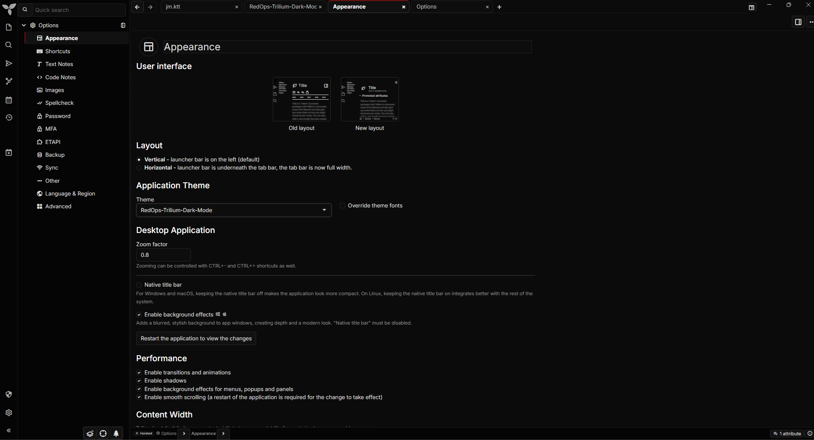

# RedOps - Trilium Dark Mode Theme

A true dark mode theme for Trilium Notes, created for people who really like DarkMode.


RedOps focuses on a real dark mode experience: deep black backgrounds, subtle red highlights, readable text, consistent hover states, dark dialogs, dark menus, and fewer bright UI elements interrupting the interface.



## Features

- True dark mode interface
- Deep black background instead of washed-out gray
- Subtle red accent color
- Clean and readable layout
- JetBrains Mono support for code notes
- Consistent hover and active states
- Dark-styled sidebars, tabs, menus, dropdowns, dialogs, and modals
- Improved text selection visibility
- Custom CodeMirror styling
- Better contrast across buttons, toolbars, panels, and note content
- Designed for users who prefer a darker and cleaner Trilium experience

## Installation

1. Create a new note in Trilium.
2. Change the note type to `CSS`.
3. Paste the raw contents of `redops.css`.
4. Add the following owned attribute to the note:

```text
#appTheme=RedOps
```

5. Open **Options**.
6. Go to **Appearance**.
7. Select **RedOps** as the theme.
8. Reload the frontend if needed using `Ctrl + R`.

## Updating

To update RedOps:

1. Open your RedOps CSS note in Trilium.
2. Replace the current CSS with the latest version from `redops.css`.
3. Save the note.
4. Reload Trilium using `Ctrl + R`.

## Fonts

RedOps uses:

- Inter for the main interface
- JetBrains Mono for code notes

By default, the theme imports these fonts from the web.

For fully offline usage, install the fonts locally and remove or adjust the `@import` lines in the CSS.

## Customization

To change the red accent color, replace occurrences of:

```css
#d81717
```

You can also adjust the main background by changing:

```css
#0b0b0b
```

## Repository Structure

```text
RedOps-Trilium-Dark-Mode/
├── img/
│   └── RedOps0.png
│   └── RedOps0.png
├── README.md
└── redops.css
```

## Compatibility

RedOps was created and tested specifically on Trilium Notes `v0.102.2`.

Some UI elements may vary depending on your Trilium version. If you find a bright element, broken contrast, or an uncovered component, open an issue with a screenshot and your Trilium version.

## Trilium Notes

Trilium Notes is maintained by the TriliumNext project.

Official repository: https://github.com/TriliumNext/Trilium

## Donation

If you enjoy this theme and would like to support the Trilium Notes project, please consider sponsoring or supporting the TriliumNext project.

This theme is free to use, and donations are better directed to the project that makes Trilium Notes possible.
